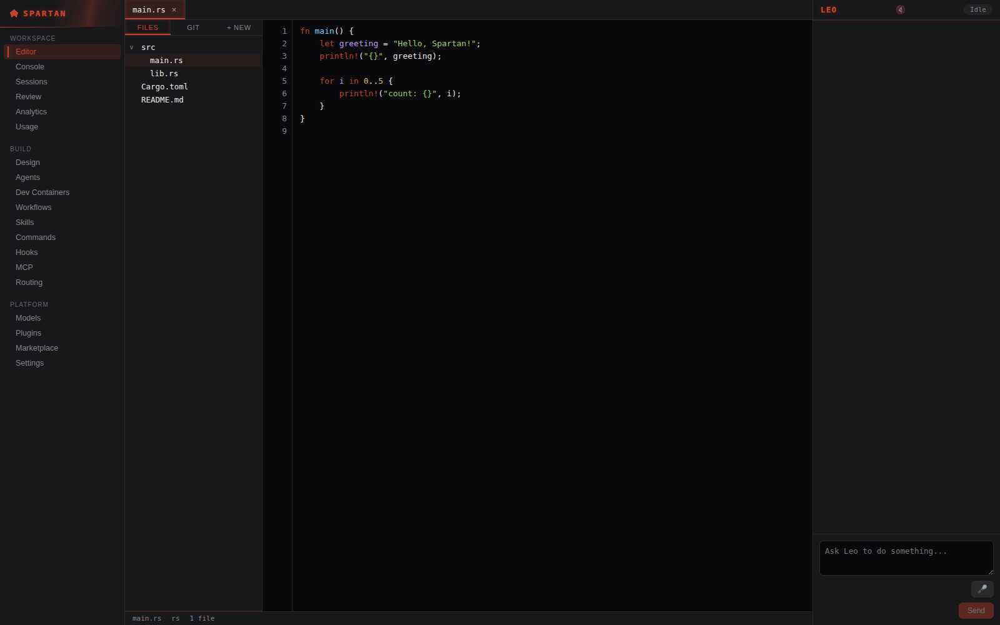
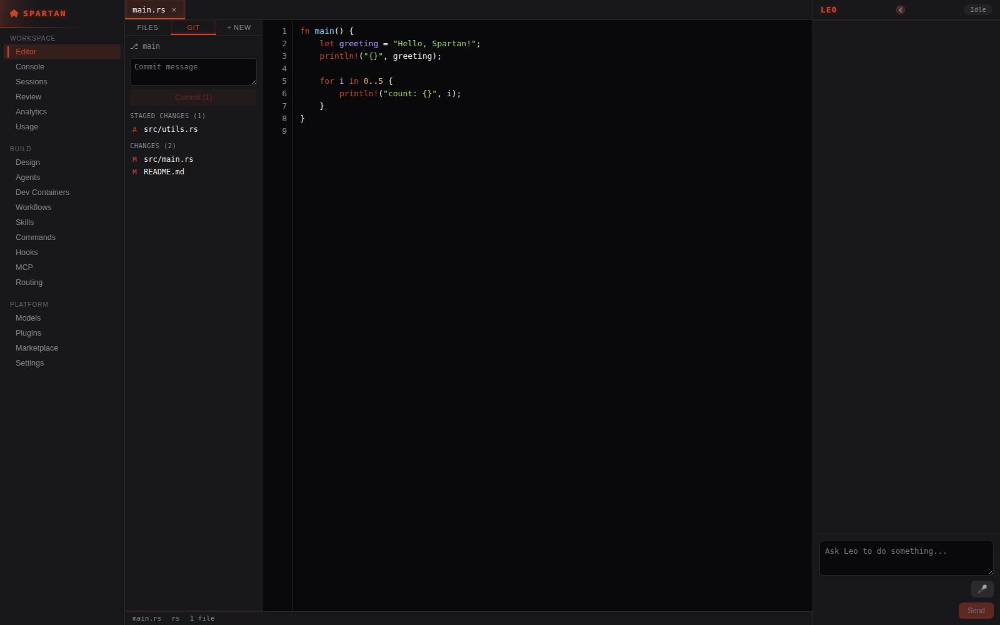
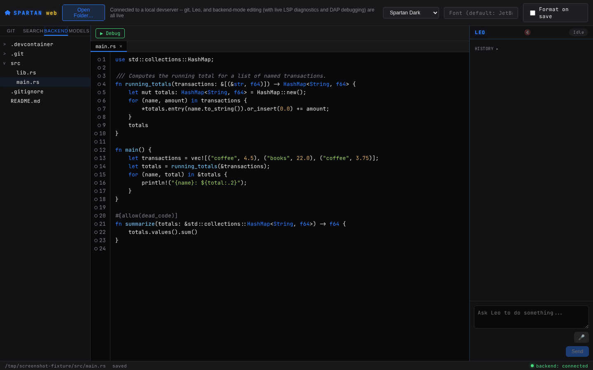
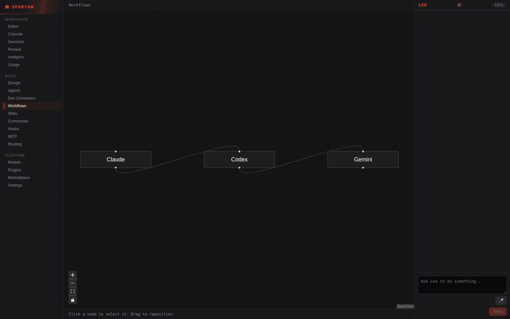

# Spartan IDE

**Open source under the Apache License, Version 2.0.** © 2026 CKissinger1988. See
[License](#license).

**A from-scratch, agent-first desktop IDE.** A real Electron + React frontend
(`desktop/`) drives a real Rust core — a hand-built rope buffer, tree-sitter syntax
highlighting, in-house LSP/DAP clients, real git integration, and **Leo**, an agentic
coding assistant with a plan → approve → execute → verify loop — over a local IPC
service. No VS Code, Monaco, or CodeMirror code is forked or vendored anywhere in this
repository. Two more real, separate shells share the identical Rust core: `web/` (a
client-side, File System Access + WASM browser IDE) and `mobile/` (a real Expo/React
Native companion app).

This README says exactly what's real and what isn't. See
["What's actually real right now"](#whats-actually-real-right-now) before assuming
anything beyond that — and see [`CLAUDE.md`](CLAUDE.md) for the full, continuously
updated status log this section summarizes (it's the actual source of truth; this file
is a snapshot of it for a reader who wants the short version).

**Beta downloads and this same README, rendered, live on the project's own GitHub Pages
site** (source-free — no repository access required, no source file ever served) —
see [Beta downloads](#beta-downloads--live-documentation) below.

## Why from scratch

Forking VS Code/Monaco is the fast path every other AI-native editor in this space has
taken (Cursor, Windsurf, Antigravity IDE) — and it's also where their documented failure
modes come from: forced app splits, extension-host isolation gaps, editor surfaces that
can't be redesigned because they're not really yours. [`docs/architecture-spec.md`](docs/architecture-spec.md)
§36 catalogs these failures by name and root-causes each one. "Own the buffer, own the
editing surface" is a locked decision, not an open question revisited per feature — the
text-editing surface in `desktop/src/components/Editor.tsx` is real, hand-built React
chrome, backed by the real Rust buffer over IPC, not a vendored component.

## Screenshots

Real, unedited Playwright + Chromium captures of the actual running React components
against a real running `spartan-backend`/`spartan-devserver` process and a real git
project fixture — not mockups, not fabricated data. The desktop shots use this
project's own established real-WebSocket-shim technique (see `desktop/README.md`),
a technique that remains useful since a real Electron launch depends on a real,
environment-specific network condition not guaranteed in every session (a genuine
native window *has* been launched, screenshotted, and verified end-to-end in one
session — see `desktop/README.md`'s own "environment-specific network condition"
section, which also documents a real preload-script bug that launch uncovered and
fixed); the shim only stands in for Electron's `contextBridge` preload hop, every
IPC call and response is real. The web shots run
directly against `web/`'s own genuine `BackendClient.connect()` — no shim needed at
all — in the backend-connected mode added since the GUI Builder removal, which also
gave `web/` real tree-sitter syntax highlighting, a Git panel, a Leo chat panel, and
LSP diagnostics (see `web/README.md`'s own screenshot captions for exactly what each
of the four captures below shows).

| | |
|---|---|
|  |  |
| Desktop: Editor screen — 3-tier nav, file tree, tabs, real tree-sitter syntax highlighting + bracket-pair colors, Leo panel | Desktop: real Source Control panel — staged/unstaged split, commit history |
|  |  |
| Web: the browser-based editor (`web/`) connected to a local devserver, real syntax highlighting | Desktop: Workflows — a real `@xyflow/react` multi-CLI node graph |

More screens (Settings, Dev Containers, editing with Leo panel, the web app's file
tree and live-editing states) are in `docs/screenshots/desktop/` and
`docs/screenshots/web/`, and embedded with full captions in `desktop/README.md` and
`web/README.md`.

## Beta downloads & live documentation

The project's own GitHub Pages site is the real, public entry point for beta downloads.
It exists precisely because a public GitHub Release page on a private repo would
404/login-wall for anyone outside the org — real installer binaries are served directly
from the Pages site's own static `/downloads/` path instead, regardless of whether the
repository itself is public or private. As of this pass the source is Apache-2.0
licensed, but the GitHub repository's own visibility setting is a separate, real toggle
in Settings that only the account owner can flip — not something any tool available in
this session can change; it remains private until that one manual step happens.

The site includes:

- **This README, rendered**, as a real documentation page — kept in sync automatically:
  the Pages deploy workflow renders the actual `README.md` on every release, so the
  public copy is never hand-duplicated and can't drift from what's checked in here.
- **Real installers** for every platform this project packages: Windows (NSIS), macOS
  (`.dmg`), Linux (`.deb`/`.AppImage`), Android (debug-signed `.apk`), plus the reference
  wgpu shell's own archives.
- **A live, in-browser copy of `web/`** — the client-side File System Access + WASM IDE,
  usable with zero install.

Every build on that page is produced by this repository's own `release.yml`/`pages.yml`
CI workflows, not hand-assembled — see [`.github/workflows/`](.github/workflows/).

## Architecture

```
desktop/                    Real Electron + React desktop shell — the current, primary UI
  electron/                 Main process: spawns spartan-backend, exposes a narrow IPC bridge
  src/                      React renderer: editor, file tree, Git panel, terminal, Leo chat,
                             Workflows canvas, Dev Containers, Models, Settings

crates/spartan-backend/     Real Rust IPC service the Electron shell drives — wraps every
                             other crate below behind a newline-delimited JSON-RPC protocol
crates/spartan-devserver/   Real localhost-only wrapper around spartan-backend for web/ —
                             adds WebSocket transport + a few devserver-only methods, falls
                             through to spartan-backend for everything else
crates/spartan-buffer/      Real rope-based document/buffer model — branching undo tree,
                             bounded checkpoint ring, char-indexed edits
crates/spartan-buffer-wasm/ Real wasm-bindgen wrapper around spartan-buffer — the exact same
                             engine, compiled for the browser, backing web/'s client-side edits
crates/spartan-languages/   Real LanguageProfile registry — LSP/DAP commands, build systems,
                             marker-file project detection, for 7 languages (Rust, TS/JS,
                             Python, Kotlin, Java, Go, C#)
crates/spartan-lsp/         Real LSP client + session management (diagnostics, hover,
                             completion, go-to-definition, rename, and more) shared by any
                             surface that wants live language intelligence off the render loop
crates/spartan-dap/         Real DAP client + session management (breakpoints, step, variable
                             inspection) — the debugging sibling of spartan-lsp, same design
crates/spartan-leo/         Real agentic core — state machine, sandboxed tool execution,
                             risk-classified approval gating, project-tier memory
crates/spartan-model/       Real ModelProvider implementations — Ollama, Claude, LiteLLM,
                             llama.cpp (direct, in-process GGUF inference)
crates/spartan-git/         Real git integration (via libgit2) — status, stage, commit,
                             Leo's own checkpoint/rollback mechanism
crates/spartan-settings/    Real persisted settings (~/.spartan/settings.json)
crates/spartan-security/    Real secrets detection/redaction (credential-shaped regexes)
crates/spartan-crash/       Real local-first crash reporter (panic hook, redacted, real
                             user-triggered upload — never automatic)
crates/spartan-updater/     Real "check for updates" against this repo's own GitHub API
crates/spartan-plugin-host/ Real WASM Component Model plugin host (wasmtime), capability-gated
crates/spartan-devcontainer/ Real OCI/Docker dev containers (containers.dev spec) via bollard
crates/spartan-android/     Real Android SDK/toolchain + project detection (first increment)
crates/spartan-editor-core/ The original wgpu-native shell — kept as the tested reference
                             implementation and backend proof-of-concept, not deleted; every
                             feature it proved was later promoted into the crates above

web/                        Real, separate Vite+React npm project — a vscode.dev-inspired
                             browser IDE with two real editing paths: fully client-side
                             (File System Access API + a real WASM-compiled spartan-buffer,
                             no backend needed) and backend-connected (a real spartan-devserver
                             over WebSocket, adding real LSP/DAP/git — no Leo chat UI here yet)
mobile/                     Real Expo/React Native companion app — Spartan Mobile IDE
spikes/                     Real Tier 0 risk-gate spikes (rope perf, LSP/DAP clients, GPU
                             rendering, local-model tool-call parsing) — not the product itself
legacy/agent-deck-console/  This repo's prior product, preserved for feature-parity reference
```

## What it actually is

### Leo — the agent

- **Real plan → approve → execute → verify loop**: a task produces an Implementation Plan
  (goal, approach, files, risk notes) you approve or reject; approval creates a real git
  checkpoint; execution proposes one real tool call at a time — `read_file`, `edit_file`
  (with a real diff preview before you approve it), `run_terminal`, `search_files`,
  `list_directory` — each one risk-classified and gated by your configured approval mode
- **Configurable approval mode**: manual (every call needs a click) or auto-approve-safe
  (read-only exploration runs immediately; `edit_file`/`run_terminal` are *never*
  auto-approved, by construction, regardless of setting)
- **Real project-tier memory**: a plain, hand-editable Markdown file at
  `.spartan/memory/project.md`, read into planning context and appended to on completion
- **Multi-provider**: switch Leo between local Ollama, Anthropic's Claude API, a local
  LiteLLM proxy, or direct in-process llama.cpp (point it at a local `.gguf` file, no
  separate server) — from Settings, no code changes. llama.cpp has real *native* tool
  calling too, via grammar-constrained sampling (a real GBNF grammar compiled from the
  tool schema forces the model's output to be structurally valid tool-call JSON) — see
  `crates/spartan-model/src/llamacpp.rs`'s own doc comment
- **Voice input/output**: dictate a task via the browser's native speech recognition;
  optionally have plan/completion/error events read aloud

### The editor

- **Real rope-based buffer** (not a text-diffing hack) with branching undo/redo, real
  save-to-disk, a real file tree, tabs, and click-to-select/drag-select
- **Real syntax highlighting** across the languages `spartan-languages` knows about
- **Real Git panel**: stage/unstage/commit against the actual repository on disk, plus
  per-file diffs, a branch switcher (list/switch/create), commit history, and per-commit
  detail (changed files + per-file diff) — all wired to the same `spartan-git` crate Leo's
  own checkpointing uses
- **Real integrated terminal** (Console) and a **real multi-CLI session manager**
  (Sessions) — spawn `claude`/`codex`/`gemini`/any named CLI as a real PTY, streamed live
  over IPC via `xterm.js`
- **Real node-graph Workflows canvas** for visualizing/launching multi-CLI orchestration
- **Real Dev Containers** (OCI/Docker-based, following the open [containers.dev](https://containers.dev)
  `devcontainer.json` spec — the same one VS Code Dev Containers, GitHub Codespaces, and
  JetBrains Gateway use): detect a project's `devcontainer.json`, build or pull its image, start
  a real container with the project bind-mounted in, run its setup command, and open a real
  interactive shell into it — test a project's Linux environment in isolation without touching
  your host machine. Not a VM — genuinely different OS *families* (Windows/macOS guests) are out
  of scope by design; see [`crates/spartan-devcontainer`](crates/spartan-devcontainer)
- **Real LSP language intelligence** — diagnostics, hover, autocomplete, go-to-definition,
  find references, rename, document symbols, signature help, and occurrence highlighting —
  plus **real DAP breakpoint/step debugging**, both live, driven by real language
  servers/debug adapters over `crates/spartan-lsp`/`crates/spartan-dap`, in both the desktop
  shell and `web/`
- **A full editor-ergonomics suite**: multi-line comment toggle, indent/outdent, duplicate,
  move, and delete line, font-size zoom, auto-closing brackets, matching-bracket highlight,
  Go to Line, in-buffer Find & Replace, Find/Replace in Files, and Format Document (with
  format-on-save)
- **Seven real, live, user-selectable themes** (Spartan Dark/Light plus five distinct
  design concepts — Minimalist Zen, Neon Aftergrid, Warm Paper, Command Deck, Glass
  Native) — switch instantly from Settings, no restart required, in every real shell
- **Real Android support**: SDK/toolchain detection, a real `assembleDebug` build
  producing an installable APK, real `adb` device listing, install, and `logcat`
  streaming, and a real Android template in the New Project wizard — see
  [`crates/spartan-android`](crates/spartan-android). No emulator/system-image or JDWP
  debugging yet; this environment has no `/dev/kvm` to build or verify that against.
- **A unified local model-management surface**: one Settings screen to check model
  provider health, start/stop a local LiteLLM proxy, and download GGUF models straight
  from Hugging Face into Ollama, LM Studio, or llama.cpp's own local model directory —
  see [`crates/spartan-backend`](crates/spartan-backend)'s model-management dispatch
  methods.

### Trust & security

- **Sandboxed, path-jailed tool execution**: Leo's tools resolve every path through a real
  jail that rejects `..` escapes and symlink tricks, confirmed by tests, not just a prompt
  instruction
- **Risk-classified approval gating**: `Safe` vs. `Destructive` is a real Rust enum Leo's
  own execution path checks — a `Destructive` call can never auto-run, in any mode
- **Secrets detection**: opened files are scanned for credential-shaped strings (AWS keys,
  GitHub/Slack/Stripe tokens, PEM blocks) and flagged
- **Local-first crash reporting**: panics are caught, redacted, and written to
  `~/.spartan/crashes/` — no auto-upload of any kind exists

Full detail on all of the above — and the much larger set of design-stage features not yet
built — lives in [`docs/architecture-spec.md`](docs/architecture-spec.md).

## Source of truth

[`docs/architecture-spec.md`](docs/architecture-spec.md) is the spec. [`CLAUDE.md`](CLAUDE.md)
is the index into it and the behavioral contract for working in this repo — read it before
touching security, sandboxing, or approval flows (§9, §36).

## What's actually real right now

- **Real, working, tested code**: everything under [Architecture](#architecture) above.
  Several hundred Rust tests across 18 real crates + 7 Tier 0 spikes + `xtask`, all
  passing; clippy and `cargo fmt` clean — see `CLAUDE.md`'s own "Build & test" section
  for the exact, continuously-updated count (fabricating a fixed number here would go
  stale immediately, so this file deliberately doesn't). The Electron shell's own
  TypeScript typechecks and builds clean, and every increment of it has been verified via
  a live, screenshotted Playwright pass driving a real Vite dev server against a
  test-only mock of the Electron preload bridge — see [Screenshots](#screenshots) above
  for real captures.
- **`web/` — a real, separate browser IDE, now with two editing paths**: a
  vscode.dev-inspired Vite+React app. Its original path is fully client-side (a real WASM
  compilation of `spartan-buffer` against the File System Access API, no backend needed).
  A second, newer path connects to a real local `spartan-devserver` process over
  WebSocket and gets real LSP diagnostics/hover/completion, real DAP breakpoint
  debugging, a real Git panel, and real Android device/build tooling — see
  [`web/README.md`](web/README.md) for exactly which path has which capability.
- **A separate, optional multi-tenant backend — Spartan Cloud (`cloud/`)**: its own,
  separate Cargo workspace (not part of `cargo build --workspace` at the repo root),
  offering per-user container allocation over a real axum control plane, WebAuthn admin
  auth, an encrypted-at-rest secrets vault, and per-tenant resource caps/audit logging.
  Billing is deliberately stubbed behind a real `EntitlementProvider` trait. See
  [`cloud/README.md`](cloud/README.md) for what's verified here vs. what needs a real
  KVM-capable target this environment doesn't have.
- **One honest, standing gap**: the *actual* Electron window has never been launched from
  inside this project's own development sessions, because Electron's postinstall script
  downloads its runtime binary from `github.com/electron/electron/releases`, and every
  sandboxed session used to build this repo so far has had that host blocked by its own
  network policy. Everything else — the real Rust backend, the full IPC protocol, every
  React component — is built and tested; it needs a real `npm install` (no
  `ELECTRON_SKIP_BINARY_DOWNLOAD`) run somewhere with normal internet access to actually
  see the window. This project's own CI now runs real `electron-builder` packaging jobs
  for Windows/macOS/Linux on hosted runners with real internet access — see
  [Beta downloads](#beta-downloads--live-documentation) above for the resulting
  installers, and [`desktop/README.md`](desktop/README.md) for the full account of this
  gap and what's still unverified about the packaged output (unsigned, first CI-built
  attempt, not yet hand-tested on a real machine of each OS).
- **Reference-only**: [`prototypes/*.jsx`](prototypes/) are early React mockups of the
  intended UI, not wired to anything. [`legacy/agent-deck-console/`](legacy/agent-deck-console/)
  is this repo's prior, different product, kept for feature-parity reference (§55).
- **Android (§21) is a real, narrow first increment, not first-class yet**: `crates/
  spartan-android` does real SDK/toolchain detection (`ANDROID_HOME`/`ANDROID_SDK_ROOT`,
  `adb`/`sdkmanager`/`avdmanager`/`emulator`) and real Android-project detection (the
  standard Gradle module layout), wired into `spartan-backend` as `android_detect`. No SDK
  install flow, emulator/device management, Compose LSP/preview, JDWP debugging, or UI
  surface yet — §35.9 itself names Android as Tier 1's biggest scope risk and explicitly
  sanctions shipping without it, which is exactly where this stands.
- **Not yet built**: a *signed* Electron installer (the unsigned one is real — see above), a
  Leo chat UI in `web/` specifically (every `leo_*` backend method is already reachable
  there over the real WebSocket transport, `web/` just has no chat panel calling them yet —
  LSP/DAP/git *are* real in `web/`'s backend-connected path, see
  [`web/README.md`](web/README.md)), and the larger design-stage surface (§35 is the
  prioritized roadmap). Local-first crash reporting now has a real, user-triggered
  *upload* path too (never automatic) — see `crates/spartan-crash`.

This project's own history includes real bugs found only by actually running code and
adversarially testing it — a UTF-8 char-boundary panic, a cross-adapter DAP deadlock, an
intermittent LSP race, a stale-selection bug caught only by testing paste-after-a-click.
See `CLAUDE.md`'s own §75.x log for the full, honest account of what was found and fixed,
pass by pass.

## Getting started

### Rust core

```bash
cargo build --release --workspace
cargo test --workspace --release
cargo clippy --workspace --release --all-targets
cargo fmt --all -- --check
```

Some integration tests spawn real external tools (`rust-analyzer`, `lldb-dap`, `debugpy`,
`cargo-component`, a live Ollama instance) and self-skip with a printed message if the
tool isn't on `$PATH` — not a failure. See `CLAUDE.md`'s "Build & test" section for the
full list and known flakiness notes.

### Desktop shell

```bash
cargo build --release -p spartan-backend   # the IPC service the Electron shell drives
cd desktop
npm install                                # needs real internet access to fetch Electron
npm start
```

See [`desktop/README.md`](desktop/README.md) for the full setup story, including the
`ELECTRON_SKIP_BINARY_DOWNLOAD=1` fallback used in this project's own restricted sessions
(which lets everything except the actual window launch build and typecheck).

### Web app (browser IDE)

```bash
cd web
npm install
npm run build:wasm   # compiles crates/spartan-buffer-wasm to WASM via wasm-bindgen
npm run dev          # real Vite dev server, http://localhost:5174
```

Needs `wasm-bindgen-cli` installed at the exact version pinned in `Cargo.lock`
(`cargo install wasm-bindgen-cli --version 0.2.126`). See [`web/README.md`](web/README.md)
for what's real (File System Access API + WASM-backed editing, plus a real backend-connected
LSP/DAP/git path) vs. what's still deferred there (Leo chat UI in this shell).

### Spartan Cloud (`cloud/`) — separate, optional

```bash
cd cloud
cargo build --workspace
cargo test --workspace
```

Its own, separate Cargo workspace — not part of the root `cargo build --workspace`. See
[`cloud/README.md`](cloud/README.md).

### Documentation site (`site/`)

The real GitHub Pages source. Locally: `python3 -m http.server 8000 --directory site`.
The production deploy (`.github/workflows/pages.yml`) additionally renders this file
(`README.md`) into a live documentation page and copies real release installers into
`site/downloads/` — neither step is reproducible locally without those same CI artifacts.

## Repository layout

```
CLAUDE.md                    Index + behavioral contract for this repo
docs/architecture-spec.md    Full technical & design spec (source of truth, 75+ sections)
docs/screenshots/            Real Playwright + Chromium captures (desktop/ and web/)
desktop/                     Electron + React desktop shell — the current primary UI
web/                         Real, separate npm project — vscode.dev-inspired browser IDE
crates/                      Real Rust product code (spartan-backend, spartan-buffer,
                              spartan-buffer-wasm, spartan-leo, spartan-model, spartan-git,
                              spartan-editor-core, and more — see Architecture above)
spikes/                      Real, tested Tier 0 Rust spikes + npm-based web-prep spikes
                              (tree-sitter-wasm-spike, git-browser-spike) — see
                              spikes/README.md
mobile/                      Spartan Mobile IDE — real Expo/React Native companion app
cloud/                       Spartan Cloud — separate, optional multi-tenant backend;
                              its own Cargo workspace, not part of the root one
site/                        Real GitHub Pages source (no source links, installers served
                              directly, README rendered at deploy time)
prototypes/                  Reference-only React UI mockups, not wired to anything
legacy/agent-deck-console/   Prior product, preserved for feature-parity reference (§55)
.github/workflows/           CI — fmt/clippy/test for Rust, typecheck/build/test for every
                              real npm project (desktop/, mobile/, web/,
                              spikes/tree-sitter-wasm-spike, spikes/git-browser-spike),
                              plus tag-triggered release.yml (installers) and pages.yml
                              (the public Pages site, including this README rendered live)
LICENSE                      Apache License, Version 2.0
Cargo.toml / Cargo.lock      Rust workspace (spikes/ + crates/, excluding crates/plugins/,
                              mobile/, and cloud/, which are separate toolchains/workspaces)
```

## Contributing / where to start reading

1. Read [`CLAUDE.md`](CLAUDE.md) in full — it's short, and it's the contract, not a
   suggestion.
2. Check [`docs/architecture-spec.md`](docs/architecture-spec.md) §35 for what's actually
   next in the build order before picking up new scope, and
   [`docs/FUTURE_FEATURES.md`](docs/FUTURE_FEATURES.md) for a prioritized backlog of
   grounded, additive next features.
3. If you're touching security, sandboxing, or approval flows, read §9 and §36 first —
   they exist because of documented, named failures in comparable tools, not
   hypothetically.

The GitHub repository itself is still marked private as of this pass (a separate,
real Settings toggle from the license below — see the "Beta downloads" section above);
until it's switched to public, this section describes how to orient as an authorized
contributor rather than how to submit an outside pull request against a repo you can't
yet see.

## License

Licensed under the **Apache License, Version 2.0**. Copyright (c) 2026 CKissinger1988.
See [`LICENSE`](LICENSE) for the full text. Every real crate and npm package in this
workspace (`crates/`, `desktop/`, `web/`, `mobile/`, `cloud/`) carries
the same license.
