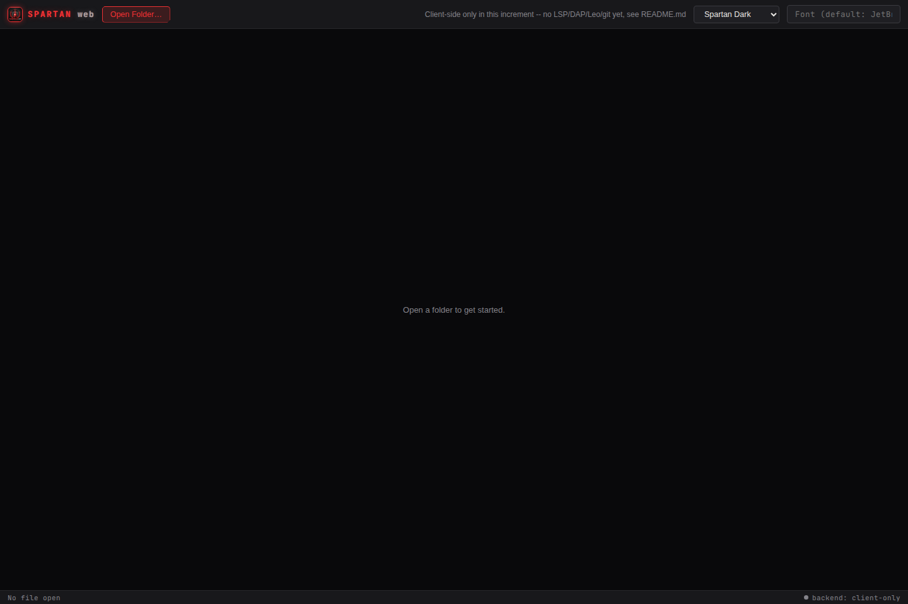
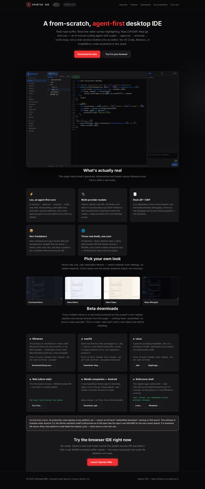

# Spartan IDE

**Open source under the Apache License, Version 2.0.** © 2026 CKissinger1988. See
[License](#license).

**A from-scratch, agent-first desktop IDE.** A real Electron + React frontend
(`desktop/`) drives a real Rust core — a hand-built rope buffer, tree-sitter syntax
highlighting, in-house LSP/DAP clients, real git integration, and **Leo**, an agentic
coding assistant with a plan → approve → execute → verify loop — over a local IPC
service. No VS Code, Monaco, or CodeMirror code is forked or vendored anywhere in this
repository. Two more real, separate shells share the identical Rust core: `web/` (a
client-side, File System Access + WASM browser IDE) and `mobile/` (a real Expo/React
Native companion app).

This README says exactly what's real and what isn't. See
["What's actually real right now"](#whats-actually-real-right-now) before assuming
anything beyond that — and see [`CLAUDE.md`](CLAUDE.md) for the full, continuously
updated status log this section summarizes (it's the actual source of truth; this file
is a snapshot of it for a reader who wants the short version).

**Beta downloads and this same README, rendered, live on the project's own GitHub Pages
site** (source-free — no repository access required, no source file ever served) —
see [Beta downloads](#beta-downloads--live-documentation) below.

## Why from scratch

Forking VS Code/Monaco is the fast path every other AI-native editor in this space has
taken (Cursor, Windsurf, Antigravity IDE) — and it's also where their documented failure
modes come from: forced app splits, extension-host isolation gaps, editor surfaces that
can't be redesigned because they're not really yours. [`docs/architecture-spec.md`](docs/architecture-spec.md)
§36 catalogs these failures by name and root-causes each one. "Own the buffer, own the
editing surface" is a locked decision, not an open question revisited per feature — the
text-editing surface in `desktop/src/components/Editor.tsx` is real, hand-built React
chrome, backed by the real Rust buffer over IPC, not a vendored component.

## Screenshots

Current visual captures are produced from live served builds with Playwright + Chromium — never
from mockups or edited pixels. The Web first-open state and public site homepage below are
automatically refreshed when the visual surface changes.

| | |
|---|---|
|  |  |
| Spartan Web: current client-side first-open state with the Spartan emblem and red/steel theme | Public landing page: current emblem, visual system, downloads, and browser-IDE entry point |

The desktop gallery and the backend-connected Web feature images are retained as real historical
verification evidence, not represented as current branding. Their capture conditions and refresh
rules are documented in [`docs/SCREENSHOTS.md`](docs/SCREENSHOTS.md).

## Beta downloads & live documentation

The project's own GitHub Pages site is the real, public entry point for beta downloads.
It exists precisely because a public GitHub Release page on a private repo would
404/login-wall for anyone outside the org — real installer binaries are served directly
from the Pages site's own static `/downloads/` path instead, regardless of whether the
repository itself is public or private. As of this pass the source is Apache-2.0
licensed, but the GitHub repository's own visibility setting is a separate, real toggle
in Settings that only the account owner can flip — not something any tool available in
this session can change; it remains private until that one manual step happens.

The site includes:

- **This README, rendered**, as a real documentation page — kept in sync automatically:
  the Pages deploy workflow renders the actual `README.md` on every release, so the
  public copy is never hand-duplicated and can't drift from what's checked in here.
- **Real installers** for every platform this project packages: Windows (NSIS), macOS
  (`.dmg`), Linux (`.deb`/`.AppImage`), Android (debug-signed `.apk`), plus the reference
  wgpu shell's own archives.
- **A live, in-browser copy of `web/`** — the client-side File System Access + WASM IDE,
  usable with zero install.

Every build on that page is produced by this repository's own `release.yml`/`pages.yml`
CI workflows, not hand-assembled — see [`.github/workflows/`](.github/workflows/).

## Architecture

```
desktop/                    Real Electron + React desktop shell — the current, primary UI
  electron/                 Main process: spawns spartan-backend, exposes a narrow IPC bridge
  src/                      React renderer: editor, file tree, Git panel, terminal, Leo chat,
                             Workflows canvas, Dev Containers, Models, Settings

crates/spartan-backend/     Real Rust IPC service the Electron shell drives — wraps every
                             other crate below behind a newline-delimited JSON-RPC protocol
crates/spartan-devserver/   Real private-server wrapper around spartan-backend for web/ — loopback
                             by default; an explicit paired LAN/WAN bind is available with a
                             pairing secret. Adds WebSocket transport + devserver methods and
                             falls through to spartan-backend for everything else
crates/spartan-buffer/      Real rope-based document/buffer model — branching undo tree,
                             bounded checkpoint ring, char-indexed edits
crates/spartan-buffer-wasm/ Real wasm-bindgen wrapper around spartan-buffer — the exact same
                             engine, compiled for the browser, backing web/'s client-side edits
crates/spartan-languages/   Real LanguageProfile registry — LSP/DAP commands, build systems,
                             marker-file project detection, for 7 languages (Rust, TS/JS,
                             Python, Kotlin, Java, Go, C#)
crates/spartan-lsp/         Real LSP client + session management (diagnostics, hover,
                             completion, go-to-definition, rename, and more) shared by any
                             surface that wants live language intelligence off the render loop
crates/spartan-dap/         Real DAP client + session management (breakpoints, step, variable
                             inspection) — the debugging sibling of spartan-lsp, same design
crates/spartan-leo/         Real agentic core — state machine, sandboxed tool execution,
                             risk-classified approval gating, project-tier memory
crates/spartan-model/       Real ModelProvider implementations — Ollama, Claude, LiteLLM,
                             llama.cpp (direct, in-process GGUF inference)
crates/spartan-git/         Real git integration (via libgit2) — status, stage, commit,
                             Leo's own checkpoint/rollback mechanism
crates/spartan-settings/    Real persisted settings (~/.spartan/settings.json)
crates/spartan-security/    Real secrets detection/redaction (credential-shaped regexes)
crates/spartan-crash/       Real local-first crash reporter (panic hook, redacted, real
                             user-triggered upload — never automatic)
crates/spartan-updater/     Real "check for updates" against this repo's own GitHub API
crates/spartan-plugin-host/ Real WASM Component Model plugin host (wasmtime), capability-gated
crates/spartan-devcontainer/ Real OCI/Docker dev containers (containers.dev spec) via bollard
crates/spartan-android/     Real Android SDK/toolchain + project detection (first increment)
crates/spartan-editor-core/ The original wgpu-native shell — kept as the tested reference
                             implementation and backend proof-of-concept, not deleted; every
                             feature it proved was later promoted into the crates above

web/                        Real, separate Vite+React npm project — a vscode.dev-inspired
                             browser IDE with two real editing paths: fully client-side
                             (File System Access API + a real WASM-compiled spartan-buffer,
                             no backend needed) and backend-connected (a real spartan-devserver
                             over WebSocket, adding real LSP/DAP/git and Leo chat)
gui-builder/                 Real TypeScript AST-sync and esbuild engine used by desktop's GUI Builder
mobile/                     Real Expo/React Native companion app — first-run onboarding, private
                             and cloud QR pairing, secure private-token storage, release checks
spikes/                     Real Tier 0 risk-gate spikes (rope perf, LSP/DAP clients, GPU
                             rendering, local-model tool-call parsing) — not the product itself
legacy/agent-deck-console/  This repo's prior product, preserved for feature-parity reference
```

## What it actually is

### Leo — the agent

- **Real plan → approve → execute → verify loop**: a task produces an Implementation Plan
  (goal, approach, files, risk notes) you approve or reject; approval creates a real git
  checkpoint; execution proposes one real tool call at a time — `read_file`, `edit_file`
  (with a real diff preview before you approve it), `run_terminal`, `search_files`,
  `list_directory` — each one risk-classified and gated by your configured approval mode
- **Configurable approval mode**: manual (every call needs a click) or auto-approve-safe
  (read-only exploration runs immediately; `edit_file`/`run_terminal` are *never*
  auto-approved, by construction, regardless of setting)
- **Real project-tier memory**: a plain, hand-editable Markdown file at
  `.spartan/memory/project.md`, read into planning context and appended to on completion
- **Multi-provider**: switch Leo between local Ollama, Anthropic's Claude API, a local
  LiteLLM proxy, or direct in-process llama.cpp (point it at a local `.gguf` file, no
  separate server) — from Settings, no code changes. llama.cpp has real *native* tool
  calling too, via grammar-constrained sampling (a real GBNF grammar compiled from the
  tool schema forces the model's output to be structurally valid tool-call JSON) — see
  `crates/spartan-model/src/llamacpp.rs`'s own doc comment
- **Voice input/output**: dictate a task via the browser's native speech recognition;
  optionally have plan/completion/error events read aloud

### The editor

- **Real rope-based buffer** (not a text-diffing hack) with branching undo/redo, real
  save-to-disk, a real file tree, tabs, and click-to-select/drag-select
- **Real syntax highlighting** across the languages `spartan-languages` knows about
- **Real Git panel**: stage/unstage/commit against the actual repository on disk, plus
  per-file diffs, a branch switcher (list/switch/create), commit history, and per-commit
  detail (changed files + per-file diff) — all wired to the same `spartan-git` crate Leo's
  own checkpointing uses
- **Real integrated terminal** (Console) and a **real multi-CLI session manager**
  (Sessions) — spawn `claude`/`codex`/`gemini`/any named CLI as a real PTY, streamed live
  over IPC via `xterm.js`
- **Real node-graph Workflows canvas** for visualizing/launching multi-CLI orchestration
- **Real Dev Containers** (OCI/Docker-based, following the open [containers.dev](https://containers.dev)
  `devcontainer.json` spec — the same one VS Code Dev Containers, GitHub Codespaces, and
  JetBrains Gateway use): detect a project's `devcontainer.json`, build or pull its image, start
  a real container with the project bind-mounted in, run its setup command, and open a real
  interactive shell into it — test a project's Linux environment in isolation without touching
  your host machine. Not a VM — genuinely different OS *families* (Windows/macOS guests) are out
  of scope by design; see [`crates/spartan-devcontainer`](crates/spartan-devcontainer)
- **Real LSP language intelligence** — diagnostics, hover, autocomplete, go-to-definition,
  find references, rename, document symbols, signature help, and occurrence highlighting —
  plus **real DAP breakpoint/step debugging**, both live, driven by real language
  servers/debug adapters over `crates/spartan-lsp`/`crates/spartan-dap`, in both the desktop
  shell and `web/`
- **A full editor-ergonomics suite**: multi-line comment toggle, indent/outdent, duplicate,
  move, and delete line, font-size zoom, auto-closing brackets, matching-bracket highlight,
  Go to Line, in-buffer Find & Replace, Find/Replace in Files, and Format Document (with
  format-on-save)
- **Seven real, live, user-selectable themes** (Spartan Dark/Light plus five distinct
  design concepts — Minimalist Zen, Neon Aftergrid, Warm Paper, Command Deck, Glass
  Native) — switch instantly from Settings, no restart required, in every real shell
- **Real Android support**: SDK/toolchain detection, a real `assembleDebug` build
  producing an installable APK, real `adb` device listing, install, and `logcat`
  streaming, and a real Android template in the New Project wizard — see
  [`crates/spartan-android`](crates/spartan-android). No emulator/system-image or JDWP
  debugging yet; this environment has no `/dev/kvm` to build or verify that against.
- **A unified local model-management surface**: one Settings screen to check model
  provider health, start/stop a local LiteLLM proxy, and download GGUF models straight
  from Hugging Face into Ollama, LM Studio, or llama.cpp's own local model directory —
  see [`crates/spartan-backend`](crates/spartan-backend)'s model-management dispatch
  methods.

### Trust & security

- **Sandboxed, path-jailed tool execution**: Leo's tools resolve every path through a real
  jail that rejects `..` escapes and symlink tricks, confirmed by tests, not just a prompt
  instruction
- **Risk-classified approval gating**: `Safe` vs. `Destructive` is a real Rust enum Leo's
  own execution path checks — a `Destructive` call can never auto-run, in any mode
- **Secrets detection**: opened files are scanned for credential-shaped strings (AWS keys,
  GitHub/Slack/Stripe tokens, PEM blocks) and flagged
- **Local-first crash reporting**: panics are caught, redacted, and written to
  `~/.spartan/crashes/` — no auto-upload of any kind exists

Full detail on all of the above — and the much larger set of design-stage features not yet
built — lives in [`docs/architecture-spec.md`](docs/architecture-spec.md).

## Source of truth

[`docs/architecture-spec.md`](docs/architecture-spec.md) is the spec. [`CLAUDE.md`](CLAUDE.md)
is the index into it and the behavioral contract for working in this repo — read it before
touching security, sandboxing, or approval flows (§9, §36).

## What's actually real right now

- **Desktop IDE**: Electron + React shell with onboarding, native File/View/Window/Help
  menus, project/folder open, tabs, dirty-state protection, file tree, real text editing,
  syntax highlighting, tree-sitter parsing, bracket matching and rainbow bracket colors,
  minimap navigation, find/replace, go-to-line, snippets and tab stops, line comment toggle,
  indent/outdent, duplicate/move/delete/join lines, zoom, auto-closing pairs, format-on-save,
  semantic tokens, inlay hints, document symbols, workspace symbols, hover, completion,
  signature help, definition/type-definition/implementation, references, call hierarchy,
  rename, code actions/quick fixes, diagnostics, and real backend-backed LSP sessions.
- **Debugging**: real DAP sessions with launch, breakpoints, conditional breakpoints,
  logpoints, breakpoint shifting after edits, continue/pause/step in/out/over, stack frames,
  scopes, variables, editable locals, watch expressions, evaluate/REPL, debuggee output,
  debug console state, and adapters for the configured language profiles.
- **Git and collaboration**: status, stage/unstage, whole-hunk and per-line staging, diffs,
  word-level and split diffs, discard, stash/apply/pop/drop, branches, remote branches,
  fetch/pull/push, clone, GitHub pull-request listing, blame, commit history/details,
  amend, revert, tags, cherry-pick, merge/conflict resolution, and GitHub HTTPS personal
  access tokens restricted to GitHub remotes (with SSH-agent support retained).
- **Terminal and operations**: real PTY terminal sessions, concurrent CLI sessions for
  Claude/Codex/Gemini or arbitrary commands, UTF-8 boundary-safe output, resize handling,
  bounded terminal execution, Dev Containers using the containers.dev shape, Android SDK and
  project detection, debug APK builds, ADB install/device operations, and logcat streaming.
- **Leo agent**: plan → approve/reject → execute → verify workflow; risk-classified tool
  calls; path-jailed file and terminal tools; project memory; bounded session history;
  retry/recovery; cooperative cancellation; configurable verification commands; voice input
  and optional spoken status; Ollama, Claude, LiteLLM, LM Studio, and llama.cpp providers;
  native grammar-constrained tool calling for llama.cpp; and model health/download/proxy
  management with cancellation and proxy crash restart.
- **Security and reliability**: path-jailing with traversal/symlink checks, destructive-action
  approval invariants, secrets detection and redaction, untrusted-repository boundaries,
  local-first redacted crash reports with explicit upload only, update checks, signed-release
  hooks, no automatic data upload, and no VS Code/Monaco/CodeMirror code.
- **Web IDE**: a real Vite + React browser app with a pure client-side File System Access
  + WASM editor (rope buffer, save, undo/redo, tabs, tree-sitter highlighting) and a separate
  backend-connected mode with LSP, DAP, Git, Leo chat, Android tooling, model management,
  pairing, and WebSocket transport. Chromium is the supported client for the File System
  Access path.
- **Web Studio**: template-driven HTML/CSS/JavaScript editing, sandboxed live preview,
  viewport/device emulation, portrait/landscape switching, zoom, console capture, local
  persistence, standalone HTML export, and complete `index.html`/`style.css`/`script.js`
  project export.
- **GUI Builder**: desktop-only visual JSX/TSX design mode with a structural component tree,
  sandboxed live React preview, click-to-select and drag-to-reparent, prop/style controls,
  responsive viewport presets and zoom, searchable component-library discovery/imports with child/sibling placement and atomic multi-selection placement, member-expression component insertion such as `UI.Button`, typed props for inserted components, searchable image/font asset and design-token
  discovery/insertion with atomic multi-selection image placement and unsaved active-file component exports, CSS design-token discovery/application/definition/removal from live buffers and disk plus copyable `var(--token)` references, component insertion, reparenting,
  deletion, duplication, Escape/Delete/Ctrl-or-Cmd+D canvas shortcuts, Shift-click multi-selection with synchronized canvas highlights and batch prop/style edits, lossless inline-style copy/paste across selections, typed string/number/boolean prop editing, open-tab component file switching,
  visual undo/redo controls with Ctrl/Cmd+Z, Ctrl/Cmd+Shift+Z, Ctrl/Cmd+Y, style/prop clipboard shortcuts, and versioned system-clipboard interoperability with in-memory fallback, unsaved-buffer-aware parsing/preview with stale-refresh protection, keyboard-accessible structure-tree selection and expansion, safe JSX tag renaming, multi-selection tag renaming, selected-element wrapping/unwrapping and multi-selection grouping, sibling move-up/move-down controls, multi-selection sibling reordering, child and sibling component insertion, component-palette child/sibling placement control, collapsible and searchable structure-tree navigation, source-location reveal links into the Editor, exact selected-element JSX source copy, versioned same-file JSX subtree copy/paste with child/sibling placement, selected-element accessibility auditing for alt text, accessible names, target size, and contrast with copyable live reports, image-as-background asset composition, rendered geometry/computed-style inspection with full box-model/flex/grid/overflow details and a removable visual box-model overlay, CSS snapshot copy and focus/hover/active-state preview controls, custom responsive viewport sizing with project-scoped named presets, synchronized canvas selection highlights, expanded guided layout/position/effects style controls, preview-only prop/style variants with saved presets, direct text editing and batch text replacement, literal/expression JSX prop copy/paste across selected nodes with literal-only cross-file fallback, atomic multi-property style/prop clipboard paste with literal-only cross-file fallback, typed expression props, existing-prop/style quick pickers, prop removal, style-property removal, one-click plain inline-style clearing with dynamic-style safety, atomic batch prop/style changes with dynamic-style protection, reusable per-file interaction-state presets, multi-selection subtree deletion with overlap and root safety guards, multi-selection subtree duplication with overlap and root safety guards, configurable inserted-component props and text, font asset discovery with @font-face snippet copy, editable and creatable CSS tokens, and two-way AST edits. The standalone `gui-builder/` package has 141 focused and end-to-end tests and is built separately from the
  Rust workspace.
- GUI Builder preview variants support versioned system-clipboard export/import with a session-local fallback when clipboard permissions are unavailable.
- GUI Builder live inspection also reports viewport-relative selected-element bounds in the inspector and copied CSS/accessibility handoff data.
- GUI Builder can copy a combined selected-element design handoff containing source JSX, source location, rendered styles/bounds, and accessibility findings.
- GUI Builder accessibility auditing now recognizes custom ARIA roles, keyboard focus requirements, activation handlers, and intentionally decorative images.
- GUI Builder viewport presets support Auto, Portrait, and Landscape orientation switching; custom viewports retain their explicit width and height.
- GUI Builder font assets can apply their derived family name to one or many selected elements while retaining the copyable `@font-face` snippet action.
- GUI Builder can also add a stylesheet-relative `@font-face` declaration to a selected open CSS buffer, with duplicate protection and editor undo history.
- The GUI Builder also supports batch direct-text replacement across selected elements, with ambiguous mixed text/expression fragments rejected atomically.
- **Mobile companion**: Expo/React Native onboarding, private and cloud QR pairing,
  configurable endpoints, SecureStore pairing secrets, backend connectivity, session/inbox
  views, release discovery, Android packaging, and safe first-run guidance for WAN and SSH
  forwarding.
- **Spartan Cloud**: separate axum control plane, tenant/resource accounting, WebAuthn admin
  authentication, encrypted vault, audit logging, health endpoint, operator-controlled update
  checks, and container allocation behind the EntitlementProvider seam. Stronger gVisor or
  microVM isolation and real billing remain deployment prerequisites rather than claims.
- **What remains intentionally incomplete**: code folding and multi-cursor editing require
  replacing the textarea editor surface; type hierarchy and data breakpoints depend on adapter
  capability; full rebase UI, minimap parity in every shell, AT-SPI text reading, Compose
  preview/JDWP, emulator management without KVM, signed production identities, macOS/iOS
  builds, Firefox/Safari File System Access fallback, plugin marketplace, team memory tiers,
  and several Cloud production services remain future work. See
  [`docs/FUTURE_FEATURES.md`](docs/FUTURE_FEATURES.md) for the prioritized, honest backlog.
- **Reference-only**: [`prototypes/*.jsx`](prototypes/) are early UI mockups, and
  [`legacy/agent-deck-console/`](legacy/agent-deck-console/) is the prior product preserved
  for feature-parity reference. Neither is part of the shipped runtime.

This project's own history includes real bugs found only by actually running code and
adversarially testing it — a UTF-8 char-boundary panic, a cross-adapter DAP deadlock, an
intermittent LSP race, a stale-selection bug caught only by testing paste-after-a-click.
See `CLAUDE.md`'s own §75.x log for the full, honest account of what was found and fixed,
pass by pass.

## Getting started

### Rust core

```bash
cargo build --release --workspace
cargo test --workspace --release
cargo clippy --workspace --release --all-targets
cargo fmt --all -- --check
```

Some integration tests spawn real external tools (`rust-analyzer`, `lldb-dap`, `debugpy`,
`cargo-component`, a live Ollama instance) and self-skip with a printed message if the
tool isn't on `$PATH` — not a failure. See `CLAUDE.md`'s "Build & test" section for the
full list and known flakiness notes.

### Desktop shell

```bash
cargo build --release -p spartan-backend   # the IPC service the Electron shell drives
cd desktop
npm install                                # needs real internet access to fetch Electron
npm start
```

See [`desktop/README.md`](desktop/README.md) for the full setup story, including the
`ELECTRON_SKIP_BINARY_DOWNLOAD=1` fallback used in this project's own restricted sessions
(which lets everything except the actual window launch build and typecheck).

### Web app (browser IDE)

```bash
cd web
npm install
npm run build:wasm   # compiles crates/spartan-buffer-wasm to WASM via wasm-bindgen
npm run dev          # real Vite dev server, http://localhost:5174
```

Needs `wasm-bindgen-cli` installed at the exact version pinned in `Cargo.lock`
(`cargo install wasm-bindgen-cli --version 0.2.126`). See [`web/README.md`](web/README.md)
for what's real (File System Access API + WASM-backed editing, plus a real backend-connected
LSP/DAP/git path) vs. what's still deferred there (Leo chat UI in this shell).

### Spartan Cloud (`cloud/`) — separate, optional

```bash
cd cloud
cargo build --workspace
cargo test --workspace
```

Its own, separate Cargo workspace — not part of the root `cargo build --workspace`. See
[`cloud/README.md`](cloud/README.md).

### Documentation site (`site/`)

The real GitHub Pages source. Locally: `python3 -m http.server 8000 --directory site`.
The production deploy (`.github/workflows/pages.yml`) additionally renders this file
(`README.md`) into a live documentation page and copies real release installers into
`site/downloads/` — neither step is reproducible locally without those same CI artifacts.

## Repository layout

```
CLAUDE.md                    Index + behavioral contract for this repo
docs/architecture-spec.md    Full technical & design spec (source of truth, 75+ sections)
docs/screenshots/            Real Playwright + Chromium captures (desktop/ and web/)
desktop/                     Electron + React desktop shell — the current primary UI
web/                         Real, separate npm project — vscode.dev-inspired browser IDE
crates/                      Real Rust product code (spartan-backend, spartan-buffer,
                              spartan-buffer-wasm, spartan-leo, spartan-model, spartan-git,
                              spartan-editor-core, and more — see Architecture above)
spikes/                      Real, tested Tier 0 Rust spikes + npm-based web-prep spikes
                              (tree-sitter-wasm-spike, git-browser-spike) — see
                              spikes/README.md
mobile/                      Spartan Mobile IDE — real Expo/React Native companion app
cloud/                       Spartan Cloud — separate, optional multi-tenant backend; HTTPS
                             endpoint QR pairing and operator-controlled update checks
                              its own Cargo workspace, not part of the root one
site/                        Real GitHub Pages source (no source links, installers served
                              directly, README rendered at deploy time)
prototypes/                  Reference-only React UI mockups, not wired to anything
legacy/agent-deck-console/   Prior product, preserved for feature-parity reference (§55)
.github/workflows/           CI — fmt/clippy/test for Rust, typecheck/build/test for every
                              real npm project (desktop/, mobile/, web/,
                              spikes/tree-sitter-wasm-spike, spikes/git-browser-spike),
                              plus tag-triggered release.yml (installers) and pages.yml
                              (the public Pages site, including this README rendered live)
LICENSE                      Apache License, Version 2.0
Cargo.toml / Cargo.lock      Rust workspace (spikes/ + crates/, excluding crates/plugins/,
                              mobile/, and cloud/, which are separate toolchains/workspaces)
```

## Contributing / where to start reading

1. Read [`CLAUDE.md`](CLAUDE.md) in full — it's short, and it's the contract, not a
   suggestion.
2. Check [`docs/architecture-spec.md`](docs/architecture-spec.md) §35 for what's actually
   next in the build order before picking up new scope, and
   [`docs/FUTURE_FEATURES.md`](docs/FUTURE_FEATURES.md) for a prioritized backlog of
   grounded, additive next features.
3. If you're touching security, sandboxing, or approval flows, read §9 and §36 first —
   they exist because of documented, named failures in comparable tools, not
   hypothetically.

The GitHub repository itself is still marked private as of this pass (a separate,
real Settings toggle from the license below — see the "Beta downloads" section above);
until it's switched to public, this section describes how to orient as an authorized
contributor rather than how to submit an outside pull request against a repo you can't
yet see.

## License

Licensed under the **Apache License, Version 2.0**. Copyright (c) 2026 CKissinger1988.
See [`LICENSE`](LICENSE) for the full text. Every real crate and npm package in this
workspace (`crates/`, `desktop/`, `web/`, `mobile/`, `cloud/`) carries
the same license.
