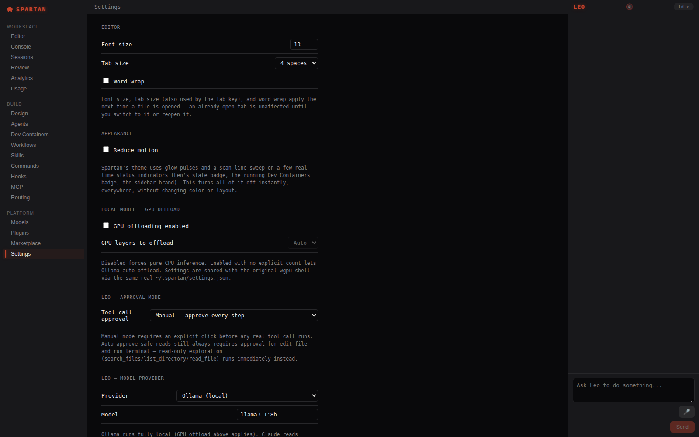
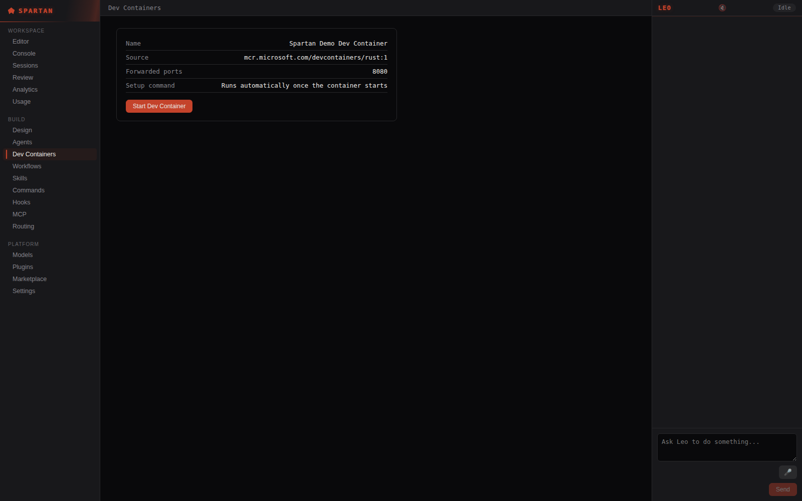
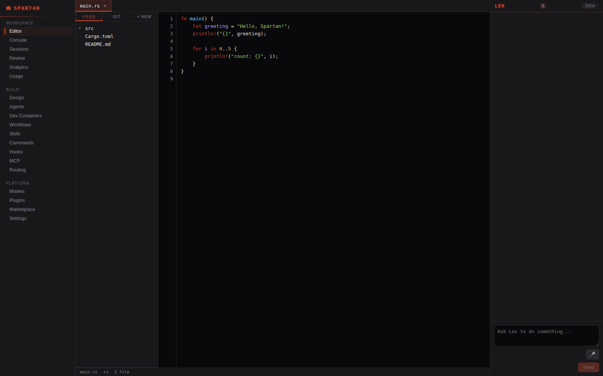

# Spartan Desktop (Electron shell)

Real Electron + React frontend for Spartan IDE, driving the existing Rust
core (`spartan-buffer`, and eventually tree-sitter/LSP/DAP/Leo/`spartan-git`)
over a local IPC service (`crates/spartan-backend`) instead of the original
wgpu-native renderer in `crates/spartan-editor-core`. See
`docs/architecture-spec.md` §75.59 for why this exists alongside that crate
(kept as the real, tested backend proof-of-concept and reference, not
deleted).

## Layout

- `electron/main.ts` — main process: creates the `BrowserWindow`, spawns the
  real `spartan-backend` release binary as a child process, registers the six
  `spartan:*` IPC channels.
- `electron/preload.ts` — the one real, narrow `contextBridge` surface the
  renderer gets (`window.spartan.call(method, params)`); no raw `ipcRenderer`,
  no Node API, `nodeIntegration: false` + `contextIsolation: true`.
- `electron/backend-client.ts` — spawns `spartan-backend` and speaks its real
  newline-delimited JSON protocol over stdin/stdout.
- `src/` — the React renderer. `Sidebar.tsx` + `nav.ts` are the real,
  persistent 3-tier navigation (Workspace/Build/Platform), its IA adapted
  (concepts only, zero code) from `OptimiLabs/velocity`'s own README --
  see `docs/architecture-spec.md` §75.60 for the full licensing discussion
  (that repo is AGPL-3.0, so nothing from its source was ever read).
  `FileTree`, `TabBar`, `StatusBar`, and `Editor` (a real, custom -- not
  Monaco/CodeMirror -- text-editing surface; see `Editor.tsx`'s own doc
  comment for exactly what "custom" means here) make up the real Editor
  screen. `WorkflowsScreen.tsx` is a real, working node-graph canvas built
  on `@xyflow/react` (MIT); `ConsoleScreen.tsx`, `SessionsScreen.tsx`,
  `SettingsScreen.tsx`, `DevContainersScreen.tsx`, and `ModelsScreen.tsx`
  are five more real, dedicated screens (`App.tsx` routes each `screen`
  value to its own component, not through `Placeholder`). `Placeholder.tsx`
  + `nav.ts`'s `SCREEN_NOTES` cover only what's genuinely still a
  placeholder (Review, Analytics, Usage, Agents, Skills, Commands, Hooks,
  MCP, Routing, Plugins, Marketplace), each with an honest, specific "what
  exists elsewhere in this project and what's missing here" message
  instead of fake content.
  `LeoChatPanel.tsx` is a real, persistent, always-visible chat panel
  (fixed sibling of `.main-column`, not a nav screen) wired to Leo's real
  `plan`/`approve`/`reject` loop -- see §75.61.

  A "Design" nav screen used to sit here too, hosting the GUI Builder and
  its live preview. The GUI Builder was removed from Spartan IDE at the
  user's explicit request -- the screen, its Electron-side client, and the
  `design_*` IPC methods are all gone, recoverable only from git history.

## Known feature gaps vs. the original wgpu shell (`crates/spartan-editor-core`)

A real audit (§75.62) originally found several real, working wgpu-shell
features not yet ported here. Since closed: syntax highlighting (§75.63,
originally via `highlight.js`, since replaced by a real three-tier chain
-- in-process tree-sitter (`web-tree-sitter`) for languages with a bundled
grammar, `highlight.js` while a grammar loads or for languages with none,
plain text as the final fallback -- see `src/syntax.ts`/`src/treeSitter.ts`),
a real terminal (Console) and multi-CLI Sessions (§75.64, streaming PTY
output over Leo's own async `Event` mechanism), and a real Git panel +
Settings screen (§75.65). **LSP and DAP are both real and wired here too**
(`crates/spartan-lsp`/`crates/spartan-dap`, real second promotions of the
wgpu shell's own `lsp.rs`/`dap.rs` for a background-thread IPC consumer):
diagnostics, hover, completion, go-to-definition/type-definition, signature
help, find-references, rename, document symbols/highlights, call hierarchy
on the LSP side; breakpoints (plain and conditional/logpoint), step/
continue, watch expressions, set-variable, and real captured stdout/
stderr/logpoint output on the DAP side -- this section used to say neither
existed at all in this shell, which is no longer true and hasn't been for
a long time. **Still real, open gaps**: the unsaved-changes confirmation
modal on close/switch (closing a dirty tab here currently discards
changes silently), and code actions/workspace-symbol search/semantic
tokens/inlay hints (investigated and found genuinely unverifiable in this
project's own sandboxed dev environment -- `pyright-langserver`, the only
real LSP server installed here, declares or exercises none of them
usefully -- so none were built rather than shipped unverified; see
`docs/FUTURE_FEATURES.md`). Each screen without real content still has a
specific, honest note in `nav.ts`'s `SCREEN_NOTES` rather than a generic
"coming soon."

## Leo's async event protocol

Unlike every other `spartan-backend` method (fast, synchronous
request/response), Leo's own plan generation is a real, possibly
20-45s+ blocking model call. `leo_start_task` returns a fast synchronous
ack; the real result arrives later as an unprompted line with an
`event` field instead of an `id` (`{"event": "leo_plan_ready", "data":
{...}}` or `"leo_plan_failed"`). `backend-client.ts` distinguishes the
two shapes and routes events through `window.spartan.onEvent(listener)`
(exposed via `preload.ts`, relayed by `main.ts`). See §75.61 for the
full design and a real, honestly-diagnosed environment finding: this
session's own Ollama backend couldn't finish loading model tensors for
either `llama3.1:8b` or a much smaller 1.2B model within request
timeouts, matching an already-documented environment-specific pattern
elsewhere in this project (§75.56, §75.57) -- the protocol itself was
independently verified correct (both the synchronous ack and a real,
asynchronously-arriving failure event), just not a full live chain with
an actual successful model response.

## Screenshots

Real, unedited Playwright + Chromium captures of the actual compiled
production build (`npm run build`), served statically by a real
`spartan-devserver` process against a real git project fixture — using
this project's own established real-WebSocket-shim verification
technique (a thin `window.spartan` that forwards every `call`/`onEvent`
over a genuine WebSocket connection to the real backend, standing in
only for Electron's own `contextBridge` preload hop, never for any
actual application logic or IPC data — a technique still useful since a
real Electron launch depends on a real, environment-specific network
condition that isn't guaranteed in every session; see "A real,
environment-specific network condition" below for the one session where
a genuine native window was launched, screenshotted, and verified
end-to-end instead). Every value on screen sourced from the
backend — file tree entries, diffs, commit history — is a real response,
not fixture/mock data; syntax highlighting itself is computed client-side
in the renderer (real tree-sitter WASM, `src/treeSitter.ts`) from that
same real file content. All six screens below are the actual, real React
components — nothing here is a static mockup.

| | |
|---|---|
|  |  |
| Editor screen: 3-tier nav, file tree, tabs, real tree-sitter syntax highlighting + bracket-pair colors, status bar, Leo panel | Source Control panel: real staged/unstaged split, commit history, stash |
|  |  |
| Settings: editor, appearance, GPU offload, Leo approval mode & provider | Workflows: a real `@xyflow/react` node graph (Claude/Codex/Gemini) |
|  | |
| Dev Containers: a real detected `devcontainer.json` config, ready to start | |
|  | |
| Editor with the file tree open and a real task typed into Leo's persistent chat panel | |

## Build & run

```bash
# 1. Build the real Rust backend (from the repo root):
cargo build --release -p spartan-backend

# 2. Install desktop deps:
cd desktop
npm install

# 3. Dev mode (two terminals):
npm run dev:renderer     # Vite dev server on :5173
npm run build:electron   # compiles electron/*.ts once, then:
electron .                # (or `npm run start` after both are built)
```

## Package a distributable (Linux AppImage)

```bash
# From the repo root, build every real artifact electron-builder bundles:
cargo build --release -p spartan-backend

cd desktop
npm install               # needs real internet access -- see the gap below
npm run package:linux     # runs `npm run build` then electron-builder --linux
```

The result lands in `desktop/dist-package/` (gitignored). `package.json`'s
`build` config bundles the real `spartan-backend` binary as
`extraResources`, and targets a Linux `AppImage`
(§75.77) -- no code signing is configured (this is a private, unsigned
build, not a publicly distributed release). Windows/macOS targets aren't
configured; this environment has no way to build or verify them.

## A real, environment-specific network condition — and a real bug it uncovered

Every session before the one that launched a real Electron window for the
first time reported a real `403` from `github.com/electron/electron/
releases/...` (the postinstall script's download host) and worked around it
with `ELECTRON_SKIP_BINARY_DOWNLOAD=1 npm install`, verifying the renderer
only via a Vite dev server + a test-only `window.spartan` stub standing in
for the real preload bridge. **A later session's own network reachability
to that host genuinely differed — a real `302` → `200`, not a proxy
artifact — and a real `npm rebuild electron` (needed because a stale
`node_modules/electron` from an earlier skip-download install silently
short-circuited a plain `npm install`) produced a real, complete Electron
binary.** This is an environment condition, not a permanent fix — it may or
may not hold in your own session; try a normal `npm install` first and fall
back to `ELECTRON_SKIP_BINARY_DOWNLOAD=1` if the download genuinely fails.

**Launching the real window immediately surfaced a real, previously-
undiscoverable bug**, invisible to every prior shim-based verification pass
since that technique never exercises the real preload script at all: the
compiled `preload.js` used ES `import` syntax (correctly matching
`electron/tsconfig.json`'s `module: "NodeNext"`, which the rest of the
main process needs), but Electron's sandboxed-preload script loader rejects
`import` outside `webPreferences.sandbox: false` — confirmed via the real
console error (`SyntaxError: Cannot use import statement outside a module`,
`source: node:electron/js2c/sandbox_bundle`) and confirmed to reproduce even
with `--no-sandbox` (a different, app-level sandboxing concept). Renaming
the output to `preload.mjs` (Electron's own documented ESM sandboxed-preload
mechanism) was tried and empirically did **not** fix it on Electron 33.4.11
— a real negative result. **Fixed for real**: `preload.ts` now compiles via
its own dedicated `electron/tsconfig.preload.json` (`module: "CommonJS"`,
excluded from the main `electron/tsconfig.json`), the one universally-
supported format for Electron's sandboxed preload context. This was a real
bug in the shipping product, not a test artifact — it would have broken
every real end user's own launch too. See `CLAUDE.md`'s own "real Electron
launch" entry for the complete, screenshotted, end-to-end account (real file
tree, real tree-sitter syntax highlighting, a real live edit + Ctrl+S save
independently confirmed by reading the file back off disk).
