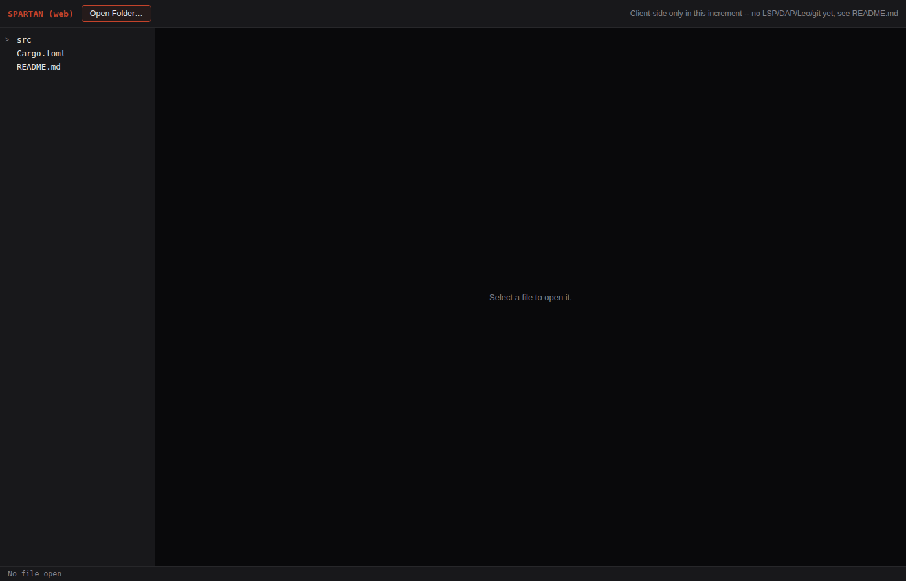
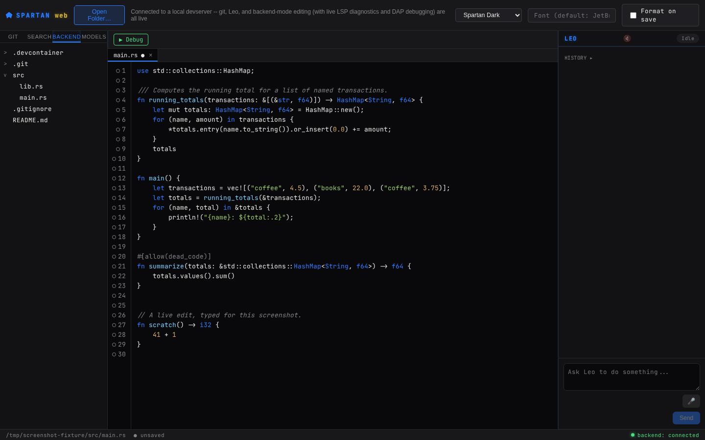

# Spartan Web (vscode.dev-inspired browser IDE)

Real, first-increment browser IDE for Spartan, built around the same **hybrid**
architecture decision the user made explicitly (§75.85, §75.86): editing/
buffer logic works standalone client-side in the browser, with backend
capabilities activating only when a local `spartan-devserver` instance is
reachable over its real WebSocket transport (§75.88). **Git is real and wired
when a devserver is connected; LSP/DAP/Leo are not yet.** See "What's not
built yet" below for the honest account of what's deferred and why.

Inspired by vscode.dev's *concepts* only — a browser-based editor working
directly against real local files via a native browser API, no server round
trip required for basic editing. **Zero VS Code or vscode.dev source code was
read or used anywhere in this project.** This is the same standing rule this
repository already applies to the desktop shells (no Monaco/CodeMirror

## Screenshots

Real, unedited Playwright + Chromium captures of this exact app running
against a real `vite dev` server. The native `showDirectoryPicker()` dialog
can't be driven headlessly, so these use the same real, documented technique
described above under "Real, executed verification" — an Origin Private File
System directory substituted in for `window.showDirectoryPicker()`, real
files written into it, then the app's own unmodified code opens and edits
them normally.

| | |
|---|---|
|  |  |
| Initial empty state — Chromium detected as supported, no fallback shown | A real project opened via the File System Access API, file tree populated |
|  |  |
| Real client-side syntax highlighting via `highlight.js` | Live typing re-highlights immediately; status bar shows the real unsaved marker |
forked/vendored either) — see the root `CLAUDE.md`.

## What's real here

- **Real local file access**: the browser's native File System Access API
  (`window.showDirectoryPicker`, `FileSystemDirectoryHandle`,
  `FileSystemFileHandle`) — no upload, no server, the browser talks to the
  real local filesystem directly. See `src/fsAccess.ts`.
- **Real editing, backed by the real engine**: `crates/spartan-buffer` (the
  same rope-based document model every other real Spartan surface uses)
  compiled to WASM via a new, real, production crate,
  `crates/spartan-buffer-wasm` — not a JS reimplementation, not a stub. See
  `src/buffer.ts` and that crate's own README/doc comments.
- **Real save-to-disk** via the File System Access API's writable-stream
  interface (Ctrl+S).
- **Real (single-step) undo** via the real `Document`'s own branching undo
  tree, exposed through the WASM binding (Ctrl+Z). **No redo yet** — a real,
  deliberate, named scope cut carried over verbatim from
  `spartan-buffer-wasm`'s own doc comment; every other real Spartan UI
  surface builds redo as a layer *above* `Document`, not inside it, and that
  layer hasn't been built here yet.
- **Real client-side syntax highlighting** via `highlight.js`, the same
  approach and the same named fidelity tradeoff (lexical, not
  tree-sitter/semantic) already used and documented in `desktop/src/syntax.ts`
  — this file is a direct, unmodified copy of that one.
- **Real file tree** with lazy, on-demand directory listing through the same
  API, mirroring `desktop/src/components/FileTree.tsx`'s own lazy-expansion
  design.

## Real, executed verification

- `npm install` / `npm run typecheck` / `npm run build` all succeed —
  including a real Vite production bundle correctly packaging the compiled
  `.wasm` asset (`spartan_buffer_wasm_bg-*.wasm`, ~186KB / ~65.5KB gzip).
- Real Playwright + Chromium verification (this environment's own
  pre-installed browser, not a mock DOM): the app's initial UI renders
  correctly (title, "Open Folder…" button, correct empty state), and the File
  System Access API's "not supported" fallback correctly does **not** appear
  in real Chromium (confirming `isFileSystemAccessSupported()` detects
  real support correctly, not just in theory).
- A second, deeper real-browser test used the Origin Private File System
  (`navigator.storage.getDirectory()`) to obtain a real, scriptable
  `FileSystemDirectoryHandle` — the same real interface `showDirectoryPicker`
  returns, used here only because the native OS picker dialog itself can't be
  driven headlessly in this sandboxed environment. Through it, this test
  directly exercised the real `fsAccess.ts` functions and the real
  WASM-backed `Document`: created a real file, listed the real directory,
  read the real file back, edited it through the real `WasmDocument.replace`,
  wrote it back, and read it a second time to confirm the write actually
  persisted — a real, complete, end-to-end round trip, not a partial check.
- **A real methodological finding along the way**: this second test initially
  failed against a `vite preview` server (`Failed to fetch dynamically
  imported module`) — `vite preview` only serves the pre-built `dist/`
  bundle, and dynamic `import()` of raw `.ts` source paths only resolves
  through Vite's **dev server** transform pipeline. Re-run against `vite dev`
  instead, it passed cleanly. Documented here so a future session doesn't
  re-discover the same thing from scratch.

## What's not built yet (named honestly, not silently missing)

- **Git is now real and wired; LSP, DAP, and Leo are not.** A later
  increment (Track A, `crates/spartan-devserver`) answered the
  token-delivery design question this section used to name as unresolved:
  the devserver serves this app's own static files, so a same-origin
  `fetch("/__spartan/session")` (see `backendClient.ts`) safely hands a
  connected page the live WebSocket token + Origin, and a further increment
  extended that same handoff to advertise the devserver's own real,
  canonicalized `--project-root:` as `projectRoot` — the piece that was
  still missing even after the transport question was solved, since
  `spartan-backend`'s `git_status`/`open_file`/Leo methods all need a real
  absolute filesystem path, and the File System Access API deliberately
  never exposes one for a folder picked via `showDirectoryPicker()` (a
  real, permanent browser security property, not an oversight). When a
  devserver is connected and advertises a project root, `App.tsx` shows a
  real Files/Git sidebar toggle and `components/GitPanel.tsx` — a direct
  port of `desktop/src/components/GitPanel.tsx` (§75.65) onto
  `BackendClient.call` — drives real `git_status`/`git_stage`/
  `git_unstage`/`git_commit` against that root. Real, live-verified:
  starting `spartan-devserver --project-root:<a real temp git repo>` and
  driving the served app with Playwright staged a real modified file,
  committed it, and the resulting commit was independently confirmed via
  `git log`/`git show` run directly against the repo on disk. **LSP is now
  real in `spartan-backend` itself** (`open_file`/`edit`/`undo`/`redo`
  spawn/drive a real language-server session and stream `lsp_diagnostics`/
  `lsp_error` events, closing a gap that had existed in *both*
  Electron-based shells since the pivot away from the wgpu reference
  shell) — and `desktop/`'s own Editor now renders it live, since that
  shell's file-open/edit path already goes through the backend's IPC
  methods unconditionally. **This app does not yet benefit**, because its
  own editing path is still File System Access + WASM, not the backend's
  `open_file`/`edit` methods this new LSP wiring hangs off of — wiring
  diagnostics in here means first giving this app a real "backend-mode"
  editing path (routing file open/edit/save through `BackendClient` when
  connected, the way `desktop/` already does unconditionally), a real,
  separate, larger increment, not attempted in this pass. DAP and Leo
  remain unwired in every shell.
- **Git operates on the devserver's own project root, not necessarily the
  File System Access folder.** A real, named consequence of the above: the
  folder opened via "Open Folder…" (File System Access) and the directory
  the connected devserver was launched against (`--project-root:`) are two
  independent concepts in this increment — nothing unifies them yet. In the
  common case (the devserver is launched from the same project the user
  opens), they're the same directory in practice, but this app has no way
  to verify that and doesn't claim to.
- **Single file open at a time.** No tabs, no multi-file model — a real,
  narrow first-increment scope, the same kind of deliberate v1 cut this
  project's own history already applies elsewhere (e.g. `gui-builder`'s own
  real v1 scope, §75.38).
- **Chromium-only.** The File System Access API is not implemented in
  Firefox or Safari. This is a real, permanent platform limit, not a bug —
  the app detects this and shows an honest message instead of failing
  silently or crashing.
- **No tree-sitter.** Same lexical-only tradeoff `desktop/`'s own editor
  already carries and documents.

## Layout

- `src/fsAccess.ts` — the real File System Access API wrapper (list/read/
  write, plus a `isFileSystemAccessSupported()` capability check).
- `src/buffer.ts` — loads the compiled `spartan-buffer-wasm` module and
  re-exports its `WasmDocument` class as `Document`.
- `src/wasm-gen/` — **generated, not committed** (see `.gitignore`).
  Regenerated by `npm run build:wasm` from `crates/spartan-buffer-wasm` via
  `wasm-bindgen`.
- `src/components/FileTree.tsx`, `src/components/Editor.tsx` — real UI,
  adapted from `desktop/src/components/`'s own equivalents, swapping IPC
  calls for direct File System Access API / WASM calls.
- `src/backendClient.ts` — the real `BackendClient`: session handoff +
  WebSocket connection to a local `spartan-devserver`, exposing its
  advertised `projectRoot` alongside the usual `call`/`onEvent` surface.
- `src/components/GitPanel.tsx` — real Source Control panel, a direct port
  of `desktop/src/components/GitPanel.tsx` onto `BackendClient.call`, shown
  only once a devserver connection advertises a real project root.
- `src/App.tsx` — top-level shell; its own doc comment names the same scope
  cuts as this file, kept in sync.
- `src/syntax.ts`, `src/theme.css` — copied verbatim from `desktop/src/` (one
  shared source of truth for color tokens and highlighting language mapping
  across both web shells).

## Build & run

```bash
npm install
npm run build:wasm   # compiles crates/spartan-buffer-wasm to WASM, generates src/wasm-gen/
npm run dev          # real Vite dev server, http://localhost:5174
npm run build         # full production build (build:wasm + tsc + vite build)
npm run typecheck
```

Requires `wasm-bindgen-cli` installed at the exact version matching this
workspace's `wasm-bindgen` crate dependency (0.2.126) — `cargo install
wasm-bindgen-cli --version 0.2.126` if `wasm-bindgen` isn't already on `PATH`.
